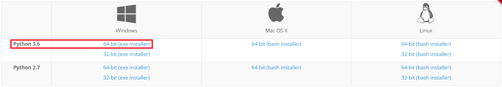
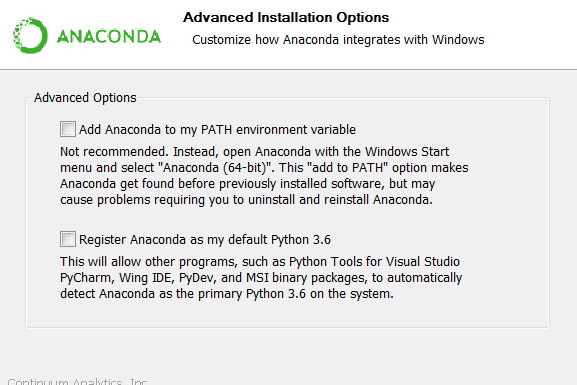
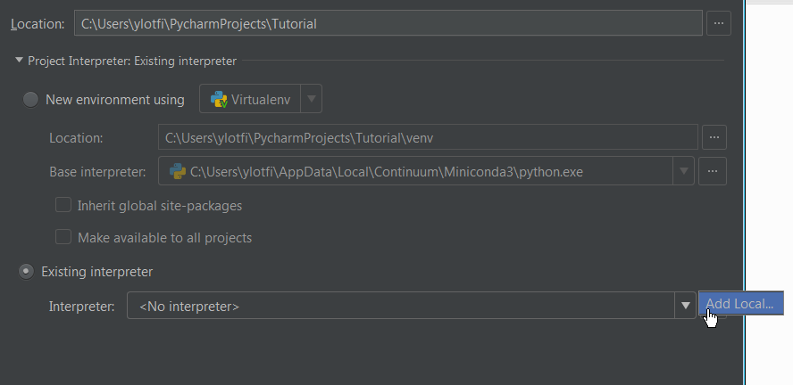
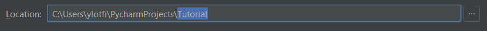

# Install Python (Miniconda)
#### Download
Get a standardized Python environment set up locally and on Amazon WorkSpaces

The set up process should be the same on both your AWS and local desktops (except the drive location). 
As such, we recommend going through this process for both systems. Having the ability to code in either 
environment is very useful. For example, Python can only communicate with a project's SQL Database in 
the AWS environment. In other cases, it can be a good idea to keep a copy of a client project locally 
to isolate code from the primary folder.

We will use an open-source distribution of Python called Miniconda. It is a stripped down version of 
the widely popular Anaconda Data Science Platform. It provides tools for managing virtual environments 
and package dependencies, emphasizing reproducability and ease of use. Go ahead and download Miniconda 
from their website, here. There are several options, but choose the *Python 3.x* installer for the *64-bit* 
version of Windows.

#### Install
Run the installer and go through the following steps:

1. Press Next and agree to the License Agreement.
1. Install locally ("Just Me").
1. **IMPORTANT:** Change the Destination Folder to either:
   * On local desktop: C:\Miniconda3
   * On AWS desktop: Try D:\Miniconda3 but if it fails, keep it in C: drive
1. Press Next and make sure both Advanced Options are not selected.
1. Proceed with the installation (refer to images below)
1. Click on the "Download Source Files" button in the sidebar and unzip the files in a location of your choosing
1. Once unzipped, Run the script called verify_install.bat
   * The installation is successful if a Python console opens
   * At the top of the console, it should say the Python version number and "Continuum Analytics"
   * Type: print("Hello, World!") and press enter
   * Congratulations, you've written a Python program!
1. Finally, run the script called create_env.bat
   * This may take 5 to 10 minutes, but it is creating a special Python environment by installing several 
     packages that are useful to common workflows in Python. To read more about Conda Environments, refer 
     to their docs here.
   * **NOTE**: It is safe to exit the install screen upon seeing this text otherwise the process is still working:

####

# Configuring PyCharm
The IDE is where you will spend most of your time programming with Python

Now that Python and Conda are on our system, we want to install something called an Integrated Development 
Environment (IDE). The best way to think of an IDE is a text editor designed for a specific programming 
language. Such integration provides a lot of useful functionality that a general-purpose text editor does 
not have. While one could rely on a simple text-editor and the command-line, we found that using PyCharm is 
a similar experience to SQL Server Studio, an IDE of its own. You can write Python, manage directories, and 
run programs in a single window. It also has code-completion features and tool tips which help the user learn 
the language and work efficiently. In short, IDEs are very advantageous for beginners learning a language as 
well as experts seeking to optimize their workflow.

First, download the Community version of PyCharm here. Simply go through all the default settings and run it 
once finished. While the default settings are fine, feel free to select the option that associates all *.py 
files with PyCharm. If it asks to import settings, just skip it and press "OK" to complete the installation 
process. It should also prompt the user to pick a theme; choose the style your prefer. Note that it can be 
changed at any time. Finally, it may ask the user install featured plugins. It doesn't hurt to install plugins 
for Markdown, Bash, and R although we will ignore them for now.

Now select Create New Project. PyCharm will point to a new folder called PyCharmProjects under your home 
directory. Just change the untitled portion of the Location's filepath to Tutorial. This will create a 
project folder that we can use moving forward. Note that every time you create a new Python project in 
PyCharm, you will be given a similar dialogue option. While you do not have to keep all project files in 
the default PyCharm directory, it is a simple way to organize projects. Another point is that PyCharm will 
always open to the last Project that you were working on.

Now we need to point PyCharm to the correct Python interpreter. To do so, select the Project Interpreter 
dropdown and select Existing Interpreter. Then select the gear icon and click on Add Local. Select Conda 
Environment in the panel to the left. Now click on the three dots next to the Interpreter input field and 
navigate to the Python executable in the path shown below. Also, make this interpreter available to other 
projects as a convenience.

At this point, wait for PyCharm to finish setting up, indicated by the progress bar at the bottom of the 
window. Once it completes, you are all set to start programming in Python using Miniconda and PyCharm. A 
few things to note. PyCharm is a keyboard centric program. Much like Excel hotkeys, you can learn shortcuts 
that make using PyCharm more productive. If you are a hotkey maniac, then you might want to spend some time 
looking at the Keymap section in settings. It shows all default shortcuts and every function can be remapped 
however you like!

Another useful thing to know is the Project Interpreter settings screen. To get there, go to Settings with 
Ctrl + Alt + S (File -> Settings). Once there, go to Project -> Project Interpreter to view which Python 
executable is being used and a list of installed packages. This should already be set but it is handy to 
know where it can be changed.

Finally, one of the most useful aspects of using PyCharm is the integrated Python Shell. This is the actual 
python program, sometimes referred to as the Interpreter or Console, that allows the developer to execute code 
line by line. Normally, this is accessed via a seperate program window, but PyCharm integrates it into the IDE. 
To pin it to your screen, go to Tools and click Python Console....
